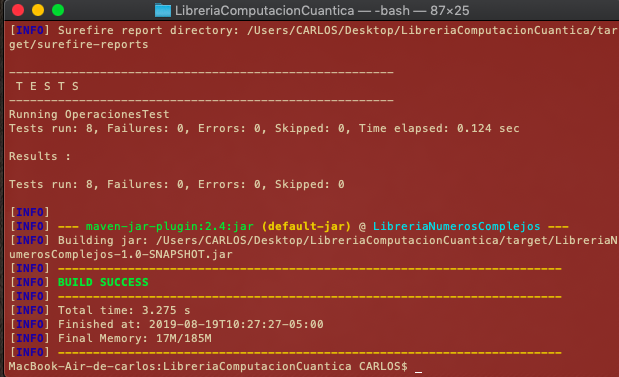

Realizado por Carlos Andrés Castañeda Lozano

# Librería computación Cuántica: Números complejos

Esta librería de computacion Cuántica podemos encontrar operaciones entre numeros complejos, los cuales tambien
se pueden extender en operaciones entre vectores y matrices.

# Operaciones 

## 1. Suma 

La operación "**suma**" recibe dos tuplas de numeros complejos y calcula su suma.

## 2. Producto

La operación "**producto**" recibe dos tuplas de numeros complejos y calcula su producto.

## 3. Resta

La operación "**resta**" recibe dos tuplas de numeros complejos y calcula su resta.

## 4. División

La operación "**division**" recibe dos tuplas de numeros complejos y calcula su división.

## 5. Módulo

La operación "**modulo**" recibe una tuplas de numeros complejos y calcula su modulo.

## 6. Conjugado

La operación "**conjugado**" recibe una tuplas de numeros complejos y calcula su conjugado.

## 7. Conversión entre representaciones polar y cartesiano

La operación "**polarACartesiano**" recibe una tuplas, un modulo y una fase o angulo y retorna un numero complejo.

## 8. Retornar la fase de un número complejo

La operación "**fase**" recibe una tuplas de numeros complejos y calcula su fase o angulo.

# Pruebas unitarias 

* Se crearon 8 pruebas las cuales corresponden a cada uno de las operaciones de numeros complejos, estas pruebas se encuentras en la case **OperacionesTest**.

* Ejemplo:
```
@Test
    public void sumaTest(){
        
        Operaciones operacion = new Operaciones();
        Complejo a = new Complejo(4,3);
        Complejo b = new Complejo(5,-7);
        Complejo c  = new Complejo(9,-4);
        Complejo respuesta = operacion.suma(a,b); 
        boolean x = operacion.equals(respuesta, c);
        assertEquals(x,flag);
                
    }
```

* Para cada una de las pruebas se implementó JUnit y Maven.
* Se creó un metodo "**equals**" la cual verifica si los resultados de las pruebas corresponden al resultado esperado
```
public boolean equals(Complejo x, Complejo y){
        if(x.getNumeroA()==y.getNumeroA() && x.getNumeroB()==y.getNumeroB()){
            return true;
        }else{
            return false;
        }
    }
```
## Ejecución de las pruebas 

**Compiling**
```
$ mvn clean compile
```
**Packing**
```
$ mvn package
```
**Running the tests**
```
$ mvn test
```


# Operaciones con vectores y matrices 

# License
This project is under the Apache license - see [LICENSE](LICENSE.txt) for more details.
